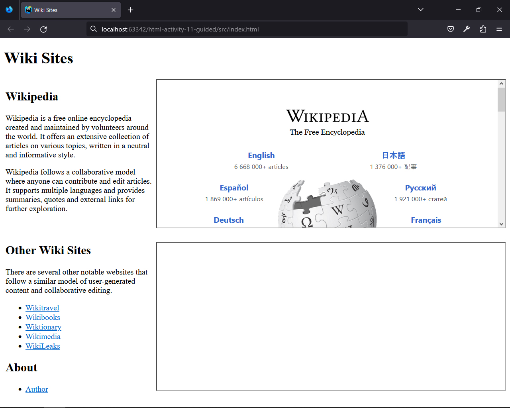
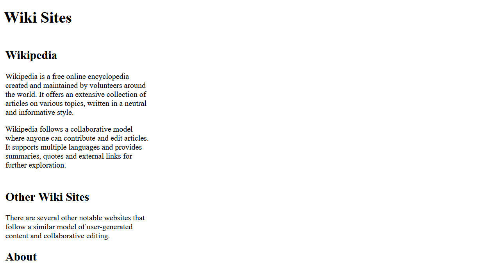
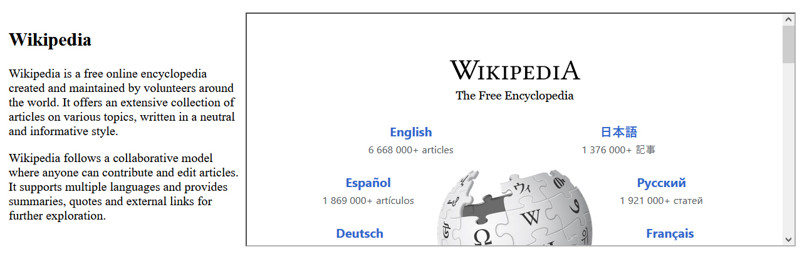
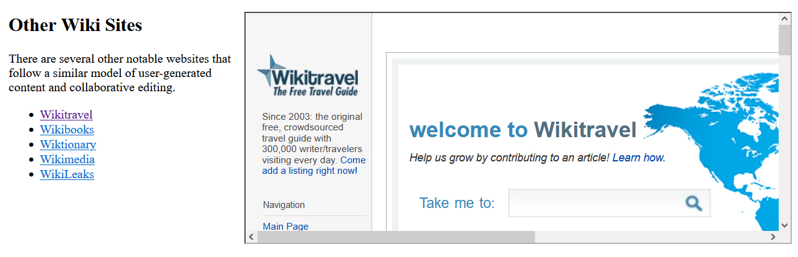
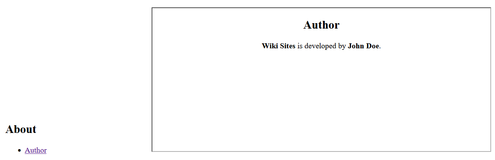

## HTML | Activity #11 (Guided): Iframes
In this activity, we will create a page called **Wiki Sites** with the following content:




### Development Setup
Create your `index.html` file inside the [**src**](/src) folder in this project,
then follow along with this guide.

To test your output, simply open it in your preferred web browser.


### Template
First, we need a regular HTML template that already contains relevant headers and paragraphs.



We will leave [comments](https://www.w3schools.com/html/html_comments.asp) for the parts that we will do later.

```html
<!DOCTYPE html>
<html lang="en">
<head>
    <meta charset="UTF-8">
    <title>Wiki Sites</title>
</head>
<body>
    <div class="header">
        <h1>Wiki Sites</h1>
    </div>
    
    <div class="section-1">
        <table width="100%">
            <tr>
                <td width="30%" valign="top">
                    <h2>Wikipedia</h2>
                    <p>
                        Wikipedia is a free online encyclopedia created and maintained by volunteers around the world.
                        It offers an extensive collection of articles on various topics,
                        written in a neutral and informative style.
                    </p>
                    <p>
                        Wikipedia follows a collaborative model where anyone can contribute and edit articles.
                        It supports multiple languages and provides summaries,
                        quotes and external links for further exploration.
                    </p>
                </td>
    
                <td width="70%">
    
                    <!-- Wikipedia -->
    
                </td>
            </tr>
        </table>
    </div>
    
    <div class="section-2">
        <table width="100%">
            <tr>
                <td width="30%" valign="top">
    
                    <h2>Other Wiki Sites</h2>
                    <p>
                        There are several other notable websites that follow a similar model of user-generated content and collaborative editing.
                    </p>
                    <!-- Other Wiki Sites links -->
    
                    <h2>About</h2>
                    <!-- About links -->
    
                </td>
    
    
                <td width="70%">

                    <!-- Destination of links -->
    
                </td>
            </tr>
        </table>
    </div>
</body>
</html>
```


### Wikipedia
HTML allows you to embed external web pages and websites
into your own web pages. In our case,
we start by embedding [**Wikipedia**](https://www.wikipedia.org).




To embed a webpage or website into our own webpage,
we simply need to know the URL.
For example, Wikipedia's URL is <https://www.wikipedia.org>.
Then we can use `<iframe>` tag in the HTML and provide this URL to its `src` attribute.

<p>
    <small>
        <b>NOTE: </b>
        Not all websites allow embedding via the <code>&lt;iframe&gt;</code> tag.
        Some websites have restrictions that prevent them from being embedded in this manner.
    </small>
</p>

```html
                    ...
                    
                    <!-- Wikipedia -->
                    <iframe
                        src="https://www.wikipedia.org"
                        width="100%"
                        height="296"
                    >
                    </iframe>
                    
                    ...
```

The `<iframe>` tag have additional attributes such us `width` and `height`.
Remember that the `<iframe>` tag is *not self-closing* and **requires a closing tag**.


### Other Wiki Sites
An interesting feature of iframes is that they can serve as destinations for our links,
allowing us to display linked content directly within the iframe.



We simply need to add a `name` attribute to the iframe element,

```html
                    ...
                    
                    <!-- Destination of links -->
                    <iframe
                        name="my-iframe-2"
                        width="100%"
                        height="296"
                    >
                    </iframe>
                    
                    ...
```

And then use the same name as the target attribute in our link `<a>` tags.

```html
                    ...
                    
                    <!-- Other Wiki Sites links -->
                    <ul>
                        <li>
                            <a href="https://wikitravel.org" target="my-iframe-2">
                                Wikitravel
                            </a>
                        </li>
                        <li>
                            <a href="https://wikibooks.org"  target="my-iframe-2">
                                Wikibooks
                            </a>
                        </li>
                        <li>
                            <a href="https://wiktionary.org" target="my-iframe-2">
                                Wiktionary
                            </a>
                        </li>
                        <li>
                            <a href="https://wikimedia.org"  target="my-iframe-2">
                                Wikimedia
                            </a>
                        </li>
                        <li>
                            <a href="https://wikileaks.org"  target="my-iframe-2">
                                WikiLeaks
                            </a>
                        </li>
                    </ul>
                    
                    ...
```

This allows the linked content to be loaded directly into the specified iframe.


### About
In addition to external links, we can load our own local webpages within an iframe.



We will provide the relative path of our
[**author.html**](/src/author.html).

```html
                    <!-- About links -->
                    <ul>
                        <li>
                            <a href="author.html" target="my-iframe-2">
                                Author
                            </a>
                        </li>
                    </ul>
```

***TODO:***
Add at least 3 more sites to the list of **Other Wiki Sites**
that can be opened in the iframe. 
